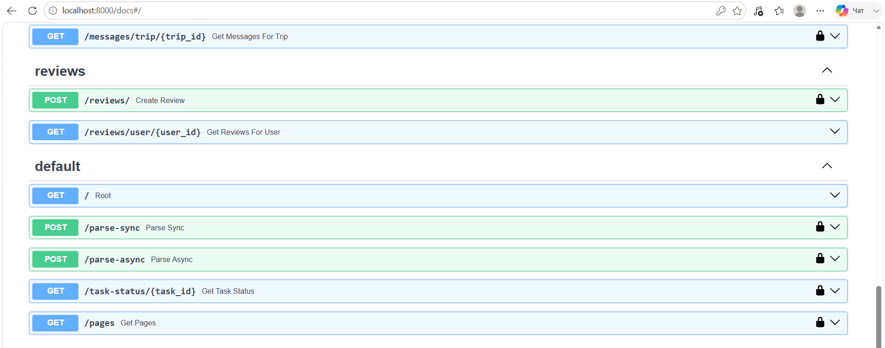
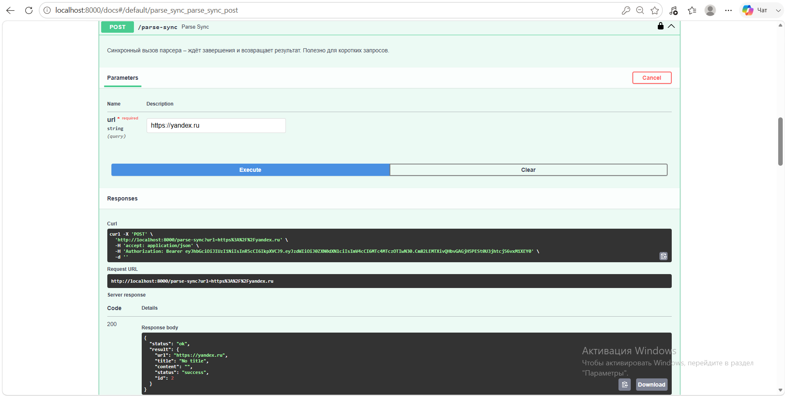
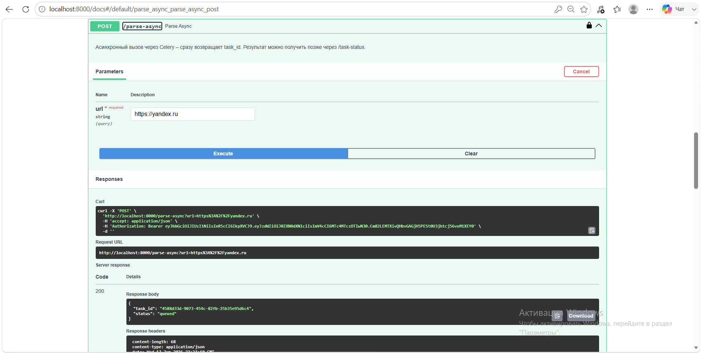
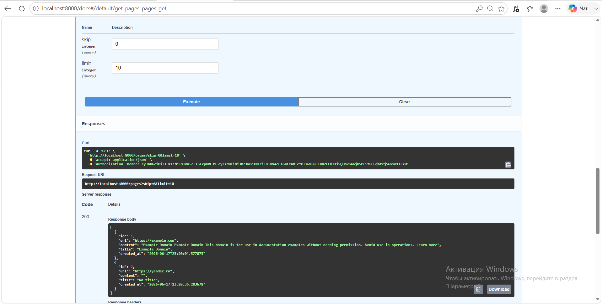
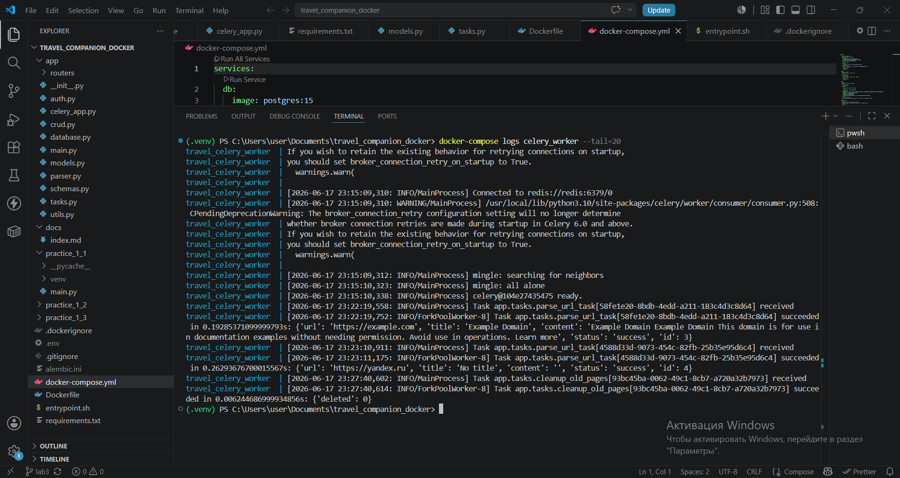

# Отчёт по лабораторной работе №3

**Тема:** Упаковка FastAPI приложения в Docker, работа с источниками данных и очередями  

---

## 1. Цель работы

Научиться упаковывать веб-приложение на FastAPI в Docker-контейнеры,
интегрировать парсер данных с базой данных PostgreSQL, организовать вызов
парсера через синхронный и асинхронный (с использованием очереди задач Celery +
Redis) API, а также настроить периодические задачи.

В ходе работы были решены следующие подзадачи:

1. Создание Docker-образов для FastAPI, PostgreSQL, Redis, Celery worker и Celery beat.
2. Реализация эндпоинтов для синхронного и асинхронного парсинга веб-страниц.
3. Настройка очереди задач Celery с брокером Redis.
4. Добавление периодической задачи для очистки устаревших записей.

---

## 2. Используемые технологии

| Технология | Назначение |
|------------|------------|
| **Python 3.10** | Язык программирования |
| **FastAPI** | Веб-фреймворк для создания REST API |
| **SQLAlchemy** | ORM для работы с PostgreSQL |
| **Alembic** | Управление миграциями базы данных |
| **PostgreSQL 15** | Реляционная база данных |
| **Redis 7** | Брокер сообщений и хранилище результатов для Celery |
| **Celery** | Асинхронная очередь задач |
| **Docker & Docker Compose** | Контейнеризация и оркестрация сервисов |
| **Uvicorn** | ASGI-сервер для запуска FastAPI |
| **aiohttp / requests / BeautifulSoup** | Парсинг веб-страниц |

---

## 3. Структура проекта

```text
travel_companion_docker/
├── .env                           # переменные окружения
├── .dockerignore
├── .gitignore
├── alembic.ini
├── docker-compose.yml             # оркестрация всех контейнеров
├── Dockerfile                     # инструкция сборки образа
├── entrypoint.sh                  # скрипт запуска (миграции + uvicorn)
├── requirements.txt               # зависимости Python
├── alembic/                       # миграции
│   ├── env.py
│   ├── script.py.mako
│   └── versions/
│       ├── 800c31780fbb_create_all_tables.py
│       └── 247ef3af0d5a_add_parsed_pages.py
└── app/
    ├── __init__.py
    ├── main.py                    # FastAPI приложение
    ├── database.py                # подключение к БД
    ├── models.py                  # SQLAlchemy модели (включая ParsedPage)
    ├── schemas.py                 # Pydantic-схемы
    ├── auth.py                    # JWT-аутентификация
    ├── crud.py                    # вспомогательные функции
    ├── parser.py                  # асинхронный парсер (из ЛР №2)
    ├── celery_app.py              # настройка Celery
    ├── tasks.py                   # задачи Celery (парсинг, очистка)
    ├── routers/                   # роутеры FastAPI
    │   ├── users.py
    │   ├── trips.py
    │   ├── applications.py
    │   ├── messages.py
    │   └── reviews.py
    └── ...
```

---

## 4. Описание ключевых файлов

### 4.1 `Dockerfile`

```dockerfile
FROM python:3.10-slim
WORKDIR /app
RUN apt-get update && apt-get install -y --no-install-recommends \
    gcc libpq-dev && rm -rf /var/lib/apt/lists/*
COPY requirements.txt .
RUN pip install --no-cache-dir -r requirements.txt
COPY . .
COPY entrypoint.sh /entrypoint.sh
RUN chmod +x /entrypoint.sh
EXPOSE 8000
ENTRYPOINT ["/entrypoint.sh"]
CMD ["uvicorn", "app.main:app", "--host", "0.0.0.0", "--port", "8000"]
```

### 4.2 `docker-compose.yml` (упрощённо)

```yaml
services:
  db:
    image: postgres:15
    environment:
      POSTGRES_USER: ${POSTGRES_USER}
      POSTGRES_PASSWORD: ${POSTGRES_PASSWORD}
      POSTGRES_DB: ${POSTGRES_DB}
    ports:
      - "5432:5432"
    volumes:
      - postgres_data:/var/lib/postgresql/data
    healthcheck:
      test: ["CMD-SHELL", "pg_isready -U ${POSTGRES_USER}"]
  redis:
    image: redis:7
    ports:
      - "6379:6379"
    healthcheck:
      test: ["CMD", "redis-cli", "ping"]
  web:
    build: .
    ports:
      - "8000:8000"
    depends_on:
      db: { condition: service_healthy }
      redis: { condition: service_healthy }
    environment:
      DATABASE_URL: postgresql://${POSTGRES_USER}:${POSTGRES_PASSWORD}@db:5432/${POSTGRES_DB}
      REDIS_URL: redis://redis:6379/0
      SECRET_KEY: ${SECRET_KEY}
      ALGORITHM: ${ALGORITHM}
      ACCESS_TOKEN_EXPIRE_MINUTES: ${ACCESS_TOKEN_EXPIRE_MINUTES}
  celery_worker:
    build: .
    command: celery -A app.celery_app worker --loglevel=info
    depends_on:
      - db
      - redis
    environment:
      DATABASE_URL: postgresql://${POSTGRES_USER}:${POSTGRES_PASSWORD}@db:5432/${POSTGRES_DB}
      REDIS_URL: redis://redis:6379/0
  celery_beat:
    build: .
    command: celery -A app.celery_app beat --loglevel=info
    depends_on:
      - redis
      - db
    environment:
      DATABASE_URL: postgresql://${POSTGRES_USER}:${POSTGRES_PASSWORD}@db:5432/${POSTGRES_DB}
      REDIS_URL: redis://redis:6379/0
volumes:
  postgres_data:
```

### 4.3 `entrypoint.sh`

```bash
#!/bin/bash
set -e
alembic upgrade head
exec "$@"
```

### 4.4 `app/parser.py` (асинхронный парсер)

```python
import aiohttp
from bs4 import BeautifulSoup

async def parse_url_async(url: str) -> dict:
    try:
        timeout = aiohttp.ClientTimeout(total=10)
        async with aiohttp.ClientSession(timeout=timeout) as session:
            async with session.get(url) as response:
                response.raise_for_status()
                html = await response.text()
                soup = BeautifulSoup(html, 'html.parser')
                title = soup.title.string.strip() if soup.title and soup.title.string else "No title"
                text = soup.get_text(separator=' ', strip=True)
                content = text[:500]
                return {"url": url, "title": title, "content": content, "status": "success"}
    except Exception as e:
        return {"url": url, "status": "error", "error": str(e)}
```

### 4.5 `app/celery_app.py`

```python
from celery import Celery
import os
REDIS_URL = os.getenv("REDIS_URL", "redis://redis:6379/0")
celery_app = Celery("travel_companion", broker=REDIS_URL, backend=REDIS_URL, include=["app.tasks"])
celery_app.conf.update(
    task_serializer="json",
    accept_content=["json"],
    result_serializer="json",
    timezone="Europe/Moscow",
    enable_utc=True,
    beat_schedule={
        "cleanup-old-pages": {
            "task": "app.tasks.cleanup_old_pages",
            "schedule": 86400.0,
        },
    },
)
```

### 4.6 `app/tasks.py`

```python
from .celery_app import celery_app
from .parser import parse_url_async
from .database import SessionLocal
from .models import ParsedPage
import asyncio
from datetime import datetime, timedelta

@celery_app.task
def parse_url_task(url: str):
    loop = asyncio.new_event_loop()
    asyncio.set_event_loop(loop)
    try:
        result = loop.run_until_complete(parse_url_async(url))
    finally:
        loop.close()
    db = SessionLocal()
    try:
        page = ParsedPage(url=result["url"], title=result["title"], content=result["content"])
        db.add(page)
        db.commit()
        db.refresh(page)
        result["id"] = page.id
        result["status"] = "success"
    except Exception as e:
        db.rollback()
        result = {"url": url, "status": "error", "error": str(e)}
    finally:
        db.close()
    return result

@celery_app.task
def cleanup_old_pages():
    db = SessionLocal()
    cutoff = datetime.utcnow() - timedelta(days=7)
    try:
        deleted = db.query(ParsedPage).filter(ParsedPage.created_at < cutoff).delete()
        db.commit()
        return {"deleted": deleted}
    except Exception as e:
        db.rollback()
        return {"error": str(e)}
    finally:
        db.close()
```

### 4.7 `app/main.py` (добавленные эндпоинты)

```python
from fastapi import FastAPI, Depends, HTTPException
from .routers import users, trips, applications, messages, reviews
from .auth import get_current_active_user
from .models import User, ParsedPage
from .parser import parse_url_async
from .tasks import parse_url_task
from .celery_app import celery_app
from .database import SessionLocal

app = FastAPI(title="Travel Companion API", version="1.0")
app.include_router(users.router)
app.include_router(trips.router)
app.include_router(applications.router)
app.include_router(messages.router)
app.include_router(reviews.router)

@app.post("/parse-sync")
async def parse_sync(url: str, current_user: User = Depends(get_current_active_user)):
    result = await parse_url_async(url)
    db = SessionLocal()
    page = ParsedPage(url=result["url"], title=result["title"], content=result["content"])
    db.add(page)
    db.commit()
    db.refresh(page)
    db.close()
    result["id"] = page.id
    return {"status": "ok", "result": result}

@app.post("/parse-async")
def parse_async(url: str, current_user: User = Depends(get_current_active_user)):
    task = parse_url_task.delay(url)
    return {"task_id": task.id, "status": "queued"}

@app.get("/task-status/{task_id}")
def get_task_status(task_id: str, current_user: User = Depends(get_current_active_user)):
    task = celery_app.AsyncResult(task_id)
    if task.ready():
        return {"status": "completed", "result": task.result}
    else:
        return {"status": "pending"}

@app.get("/pages")
def get_pages(skip: int = 0, limit: int = 10, current_user: User = Depends(get_current_active_user)):
    db = SessionLocal()
    pages = db.query(ParsedPage).offset(skip).limit(limit).all()
    db.close()
    return pages
```

---

## 5. Запуск и тестирование

### 5.1 Сборка и запуск контейнеров

```bash
docker-compose up -d --build
```

Все пять контейнеров успешно запущены:

| Контейнер | Статус | Порты |
|-----------|--------|-------|
| travel_web | Up | 0.0.0.0:8000->8000 |
| travel_celery_worker | Up | 8000/tcp |
| travel_celery_beat | Up | 8000/tcp |
| travel_db | Up (healthy) | 0.0.0.0:5432->5432 |
| travel_redis | Up (healthy) | 0.0.0.0:6379->6379 |

### 5.2 Регистрация и авторизация

**Регистрация пользователя** (`POST /users/register`):

```json
{
  "email": "test@example.com",
  "username": "testuser",
  "password": "securepass"
}
```

**Ответ:**

```json
{
  "email": "test@example.com",
  "username": "testuser",
  "id": 1,
  "role": "user",
  "created_at": "2026-06-17T23:16:55.615367"
}
```

**Логин** (`POST /users/login`):

```json
{
  "access_token": "eyJhbGciOiJIUzI1NiIsInR5cCI6IkpXVCJ9...",
  "token_type": "bearer"
}
```

Токен использован для авторизации в Swagger.

---

### 5.3 Синхронный парсинг

**Запрос:** `POST /parse-sync?url=https://example.com`

**Ответ:**

```json
{
  "status": "ok",
  "result": {
    "url": "https://example.com",
    "title": "Example Domain",
    "content": "Example Domain Example Domain This domain is for use in documentation examples without needing permission. Avoid use in operations. Learn more",
    "status": "success",
    "id": 1
  }
}
```

**Запрос:** `POST /parse-sync?url=https://yandex.ru`

**Ответ:**

```json
{
  "status": "ok",
  "result": {
    "url": "https://yandex.ru",
    "title": "No title",
    "content": "",
    "status": "success",
    "id": 2
  }
}
```

---

### 5.4 Асинхронный парсинг через Celery

**Запрос:** `POST /parse-async?url=https://example.com`

**Ответ:**

```json
{
  "task_id": "58fe1e20-8bdb-4edd-a211-183c4d3c8d64",
  "status": "queued"
}
```

**Проверка статуса:** `GET /task-status/58fe1e20-8bdb-4edd-a211-183c4d3c8d64`

Через несколько секунд:

```json
{
  "status": "completed",
  "result": {
    "url": "https://example.com",
    "title": "Example Domain",
    "content": "Example Domain Example Domain This domain is for use in documentation examples without needing permission. Avoid use in operations. Learn more",
    "status": "success",
    "id": 3
  }
}
```

Аналогично для `https://yandex.ru` (задача id `4588d33d-9073-454c-82fb-25b35e95d6c4`) — результат сохранён с `id=4`.

---

### 5.5 Просмотр сохранённых страниц

**Запрос:** `GET /pages`

**Ответ:**

```json
[
  {
    "id": 1,
    "url": "https://example.com",
    "title": "Example Domain",
    "content": "Example Domain Example Domain This domain is for use in documentation examples without needing permission. Avoid use in operations. Learn more",
    "created_at": "2026-06-17T23:20:04.577873"
  },
  {
    "id": 2,
    "url": "https://yandex.ru",
    "title": "No title",
    "content": "",
    "created_at": "2026-06-17T23:20:36.203678"
  },
  {
    "id": 3,
    "url": "https://example.com",
    "title": "Example Domain",
    "content": "Example Domain Example Domain This domain is for use in documentation examples without needing permission. Avoid use in operations. Learn more",
    "created_at": "2026-06-17T23:22:19.752451"
  },
  {
    "id": 4,
    "url": "https://yandex.ru",
    "title": "No title",
    "content": "",
    "created_at": "2026-06-17T23:23:11.174928"
  }
]
```

---

### 5.6 Логи Celery worker

```text
[2026-06-17 23:15:09,310: INFO/MainProcess] Connected to redis://redis:6379/0
[2026-06-17 23:15:10,338: INFO/MainProcess] celery@104e27435475 ready.
[2026-06-17 23:22:19,558: INFO/MainProcess] Task app.tasks.parse_url_task[58fe1e20-...] received
[2026-06-17 23:22:19,752: INFO/ForkPoolWorker-8] Task succeeded in 0.19s: {'url': 'https://example.com', ...}
[2026-06-17 23:23:10,911: INFO/MainProcess] Task app.tasks.parse_url_task[4588d33d-...] received
[2026-06-17 23:23:11,175: INFO/ForkPoolWorker-8] Task succeeded in 0.26s: {'url': 'https://yandex.ru', ...}
```

### 5.7 Проверка периодической задачи (ручной вызов)

```bash
docker-compose exec celery_worker celery -A app.celery_app call app.tasks.cleanup_old_pages
```

**Ответ:** `93bc45ba-0062-49c1-8cb7-a720a32b7973` (идентификатор задачи)

**Логи** подтверждают выполнение:

```text
[2026-06-17 23:27:40,602: INFO/MainProcess] Task app.tasks.cleanup_old_pages[93bc45ba-...] received
[2026-06-17 23:27:40,614: INFO/ForkPoolWorker-8] Task succeeded in 0.006s: {'deleted': 0}
```

---

## 6. Скриншоты


**Рисунок 1** — Swagger документация с новыми эндпоинтами


**Рисунок 2** — Ответ синхронного парсинга для yandex.ru


**Рисунок 3** — Постановка задачи в очередь и статус выполнения


**Рисунок 4** — Список сохранённых страниц


**Рисунок 5** — Логи Celery с успешным выполнением задач

---

## 7. Выводы

В ходе выполнения лабораторной работы №3 были достигнуты следующие результаты:

1. **Разработана Docker-архитектура**, включающая пять контейнеров: FastAPI
   (web), PostgreSQL (db), Redis (брокер), Celery worker и Celery beat. Это
   обеспечивает изолированное и воспроизводимое окружение для всего приложения.

2. **Реализованы два способа вызова парсера**:
   - Синхронный (`/parse-sync`) — возвращает результат после выполнения,
     подходит для быстрых запросов.
   - Асинхронный (`/parse-async`) — ставит задачу в очередь Celery, возвращает
     `task_id`, позволяя отслеживать прогресс через `/task-status`. Это решение
     масштабируется и не блокирует веб-сервер при длительных операциях.

3. **Настроена периодическая задача** `cleanup_old_pages`, которая
   автоматически удаляет записи старше 7 дней. Это демонстрирует возможность
   автоматизации рутинных операций в фоне.

4. **Все эндпоинты защищены JWT-аутентификацией**, что обеспечивает
   безопасность и соответствует требованиям первой лабораторной работы.

5. **Интеграция с PostgreSQL** через SQLAlchemy и Alembic позволяет легко
   управлять схемой данных (добавлена таблица `parsed_pages`).

6. **Асинхронный парсер** на основе `aiohttp` и `BeautifulSoup` эффективно
   обрабатывает сетевые запросы, а Celery позволяет выполнять их вне основного
   потока.

Работа полностью соответствует поставленным задачам (включая дополнительный
пункт — периодические задачи). Полученный стек технологий готов к дальнейшему
развитию и может быть использован в реальных проектах для обработки больших
объёмов данных в фоновом режиме.

---

## 8. Список использованных источников

1. [FastAPI Documentation](https://fastapi.tiangolo.com/)
2. [Docker Documentation](https://docs.docker.com/)
3. [Celery Documentation](https://docs.celeryq.dev/)
4. [Redis Documentation](https://redis.io/docs/)
5. [SQLAlchemy Documentation](https://www.sqlalchemy.org/)
6. [Alembic Documentation](https://alembic.sqlalchemy.org/)
7. Материалы лекций по Web-программированию (ИТМО)

---
